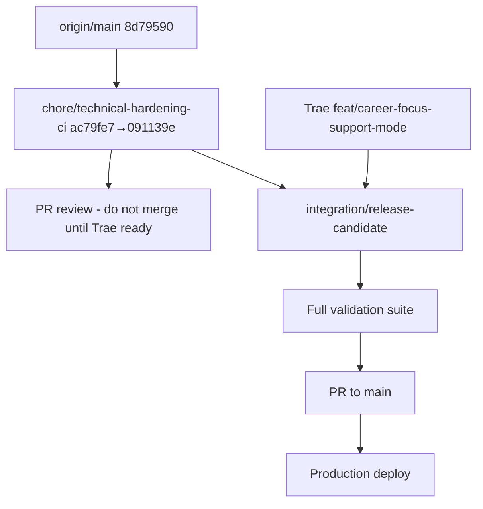

# ITPrep — Release integration plan

**Prepared:** 2026-06-04  
**Working clone:** `C:\dev\ITPrep-cursor` (non-OneDrive)  
**Do not integrate from the OneDrive working copy while Trae is active there.**

---

## 1. Branch and commit inventory

### GitHub (`origin`) — as of preparation

| Ref | Commit | Description |
|-----|--------|-------------|
| `origin/main` | `8d79590` | Make certification MCQs topic-specific and avoid generic study-method questions |
| `origin/HEAD` | → `main` | Only `main` exists on GitHub today |

**Not yet on GitHub:** `chore/technical-hardening-ci`, Copilot commits `ecf9590` / `091139e`.

### Local integration branch (`chore/technical-hardening-ci`)

Fetched from the OneDrive **git object store only** (no working-tree edits). Three commits ahead of `main`:

| Order | Commit | Author / source | Summary |
|-------|--------|-----------------|---------|
| 1 | `ac79fe7` | Cursor hardening | CI, Playwright smoke/a11y, logging, repo hygiene, ESLint policy |
| 2 | `ecf9590` | VS Code Copilot | MSP content pass: 12 scenarios, 8 roleplay personas, 8 cheat sheets, `msp.ts` module |
| 3 | `091139e` | VS Code Copilot | Fix `no-internet-classroom` scenario (third step for unit tests) |

**Branch HEAD:** `091139e` (includes `ac79fe7` as ancestor — confirmed).

### OneDrive `main` vs GitHub `main`

Identical at `8d79590`. No divergent commits on either `main`.

### Trae — Career Focus / Support Mode (in progress)

Uncommitted WIP in the OneDrive working copy (not in any branch yet). Observed modified paths:

- **App routes:** `app/page.tsx`, `app/settings/page.tsx`, `app/modules/page.tsx`, `app/cheat-sheets/page.tsx`, `app/pd-log/page.tsx`, `app/academic-pd/page.tsx`
- **Shell / nav:** `src/components/shell/navigation.ts`
- **Data / libs:** `src/data/academicSubjects.ts`, `src/data/modules/foundations.ts`, `src/data/modules/networking.ts`, `src/lib/progress.ts`, `src/lib/studyPath.ts`, `src/lib/readinessMath.ts`, `src/lib/evidencePack.ts`, `src/lib/academicPublish.ts`
- **Types / tests:** `src/types/scenarios.ts`, `src/tests/careerMode.test.ts`

Trae must **commit and push a feature branch** before integration (suggested name: `feat/career-focus-support-mode`).

### VS Code Copilot commits — presence

| Commit | Local (ITPrep-cursor) | GitHub remote |
|--------|---------------------|---------------|
| `ecf9590` | Yes — on `chore/technical-hardening-ci` | No |
| `091139e` | Yes — HEAD of `chore/technical-hardening-ci` | No |

---

## 2. Expected merge order

Do **not** merge Trae’s work or touch `main` until the steps below are complete and validated.



### Step-by-step

1. **Push** `chore/technical-hardening-ci` to GitHub (infrastructure + MSP content already stacked).
2. **Open PR** `chore/technical-hardening-ci` → `main` for review. **Do not merge** until Trae finishes.
3. **Trae completes** Career Focus / Support Mode → commit → push feature branch from a clean clone or after OneDrive WIP is frozen.
4. **Create integration branch** from `chore/technical-hardening-ci`:
   ```powershell
   git checkout chore/technical-hardening-ci
   git pull origin chore/technical-hardening-ci
   git checkout -b integration/release-candidate
   ```
5. **Merge Trae’s feature branch** into `integration/release-candidate` (prefer merge commit for traceability; rebase only if Trae approves).
6. **Resolve conflicts** (see §3). Preserve both sides’ intent — do not drop MSP scenarios or Career Focus types.
7. **Run full validation** (§6). Fix until green.
8. **Merge integration PR to `main`** only after checklist sign-off.
9. **Deploy** via Vercel production; run live QA + phone PWA test.

### Optional split (if MSP content should land separately)

If product wants hardening without MSP content first:

```powershell
git checkout -b chore/technical-hardening-only ac79fe7
git push -u origin chore/technical-hardening-only
# Merge ac79fe7 first, then cherry-pick ecf9590 + 091139e in a follow-up PR
```

Default recommendation: keep the three commits together — Copilot MSP work was validated against the hardening test suite on this branch.

---

## 3. Likely conflict files

### High risk (both sides edit same concern)

| File | Hardening / Copilot side | Trae side |
|------|--------------------------|-----------|
| `src/data/scenarios.ts` | Major MSP rewrite + step fix (`ecf9590`, `091139e`) | May extend scenario model via `src/types/scenarios.ts` |
| `src/components/shell/Sidebar.tsx` | `aria-label`, search button a11y (`ac79fe7`) | Career Focus nav entries via `navigation.ts` + possible Sidebar hooks |
| `src/components/shell/navigation.ts` | Unchanged on branch | Career Focus grouping / Support Mode links |
| `app/page.tsx` | Unchanged on branch | Dashboard Career Focus / Support Mode UI |
| `app/settings/page.tsx` | Unchanged on branch | `careerFocus` profile field, Support Mode toggles |
| `app/cheat-sheets/page.tsx` | Unchanged on branch | UI wiring; data lives in `src/data/cheatSheets.ts` (Copilot added 380+ lines) |
| `app/modules/page.tsx` | Unchanged on branch | Module catalog filters; new `msp.ts` module on branch |
| `src/lib/progress.ts` | Test refactors in `ac79fe7` | Career mode progress / gamification extensions |
| `src/lib/studyPath.ts` | Unchanged on branch | Career-aware study paths |
| `src/lib/readinessMath.ts` | Unchanged on branch | Readiness scoring with career focus |
| `src/data/academicSubjects.ts` | Restored in hardening tests context | Trae academic subject updates |

### Medium risk

| File | Notes |
|------|-------|
| `src/data/modules/foundations.ts`, `networking.ts` | Trae edits; branch adds `src/data/modules/msp.ts` — merge module index/registry if a central list exists |
| `src/data/roleplayScenarios.ts` | Copilot added personas; Trae may touch roleplay routing |
| `app/modules/[moduleId]/page.tsx` | Minor hardening tweak; Trae may change module shell |
| `app/layout.tsx` | `role="main"` / `#main-content` — keep hardening a11y attributes |
| `package.json` / `package-lock.json` | Hardening adds Playwright; Trae may add deps — merge both dependency blocks |
| `src/tests/careerMode.test.ts` | New Trae test; must pass with updated `moduleMath` / progress helpers from `ac79fe7` |

### Low risk (hardening-only — accept incoming)

- `.github/workflows/ci.yml`
- `e2e/smoke.spec.ts`, `e2e/accessibility.spec.ts`, `playwright.config.ts`
- `src/lib/logger.ts`, AI route logging changes
- `eslint.config.cjs`, `.gitignore`, `vitest.config.ts`
- `docs/DEVELOPMENT.md`, `docs/TECHNICAL_HARDENING_REPORT.md`

---

## 4. Preserve Career Focus / Support Mode work

1. Trae commits **all** WIP to a dedicated feature branch before any merge into `integration/release-candidate`.
2. During conflict resolution on shared files:
   - Keep **`UserProfile.careerFocus`** (and related types) from Trae.
   - Keep **Support Mode** UI and routing from Trae’s `app/settings/page.tsx` and dashboard changes.
   - Do **not** revert Trae’s `src/tests/careerMode.test.ts` — fix implementation until tests pass.
3. After merge, verify Career Focus appears in navigation and settings persist across reload (`localStorage` / profile store).
4. Run `npm run test:ci` and confirm `careerMode.test.ts` is included and green.

---

## 5. Preserve MSP modules, scenarios, roleplays, and cheat sheets

Copilot commits on `chore/technical-hardening-ci`:

| Asset | Path | Commit |
|-------|------|--------|
| MSP module | `src/data/modules/msp.ts` | `ecf9590` |
| Scenarios (12) | `src/data/scenarios.ts` | `ecf9590`, `091139e` |
| Roleplay personas (8) | `src/data/roleplayScenarios.ts` | `ecf9590` |
| Cheat sheets (8) | `src/data/cheatSheets.ts` | `ecf9590` |

**Resolution rules:**

- Treat `src/data/scenarios.ts` on the branch as the **content source of truth** for MSP scenarios unless Trae’s type changes require mechanical updates (add fields, don’t delete scenarios).
- Keep **`no-internet-classroom` step 3** from `091139e` — required by unit tests.
- Register `msp` in any module catalog Trae modifies (`app/modules/page.tsx`, module index files).
- Smoke tests already cover `/scenarios` and `/simulations/roleplay` — run Playwright after merge.

---

## 6. Preserve CI, Playwright, logging hardening, and repo hygiene

Accept **all** changes from `ac79fe7` unless Trae’s branch intentionally modifies the same lines:

| Area | Key files |
|------|-----------|
| GitHub Actions | `.github/workflows/ci.yml` — lint, typecheck, Vitest, audit, build, Playwright |
| E2E | `e2e/smoke.spec.ts`, `e2e/accessibility.spec.ts`, `playwright.config.ts` |
| Logging | `src/lib/logger.ts`, `app/api/ai/*/route.ts` |
| A11y shell | `app/layout.tsx` (`main` landmark), `Sidebar.tsx` (`aria-label`) |
| ESLint | `eslint.config.cjs` — `set-state-in-effect` as warn |
| Hygiene | `.gitignore`, `docs/DEVELOPMENT.md` |

After Trae merge, re-run the **full CI-equivalent command block** (§7). Do not disable audit or Playwright jobs to “get green.”

---

## 7. Commands for full validation

Run from `C:\dev\ITPrep-cursor` (or integration branch checkout):

```powershell
cd C:\dev\ITPrep-cursor
git fetch origin
git checkout integration/release-candidate   # after created

# Clean install
Remove-Item -Recurse -Force node_modules, .next -ErrorAction SilentlyContinue
npm ci

# Static analysis and unit tests
npm run lint
npm run typecheck
npm run test:ci
npm audit --audit-level=high

# Production build
npm run build

# E2E (install browsers once per machine)
npx playwright install chromium
npm run test:e2e:ci
```

### GitHub Actions

Push the integration branch and confirm both CI jobs pass:

- **quality** — lint, typecheck, unit tests, audit, build  
- **e2e** — Playwright chromium + mobile-chrome  

### Vercel

- Preview deploy should trigger on the open PR.  
- Production deploy only after merge to `main`.

---

## 8. Rollback plan

If the combined build fails after merging to `main` or production is broken:

### A. Before production deploy (PR / preview failure)

1. Do **not** merge the integration PR.
2. Fix forward on `integration/release-candidate` and re-run §7.
3. If unrecoverable, abandon integration branch and reset plan to last good state:
   ```powershell
   git checkout main
   git pull origin main
   # Re-branch from chore/technical-hardening-ci and re-merge Trae
   ```

### B. After merge to `main` but before production promote

1. **Revert merge commit** on GitHub or locally:
   ```powershell
   git checkout main
   git pull origin main
   git revert -m 1 <merge-commit-sha>
   git push origin main
   ```
2. Vercel will redeploy the previous production build from the reverted `main`.

### C. After production deploy

1. Revert merge commit on `main` (same as B) — fastest restore.
2. Alternatively, in Vercel dashboard → **Deployments** → promote last known-good deployment.
3. Document incident in `docs/FIX_NOTES.md`.
4. Re-open integration branch, fix root cause, re-validate §7, new PR.

### D. Partial rollback (content-only)

If only MSP content causes failure:

```powershell
git revert 091139e
git revert ecf9590
# Keep ac79fe7 hardening; fix MSP content in a follow-up commit
```

If only Career Focus causes failure, revert Trae’s merge commit while keeping hardening + MSP.

---

## 9. Pre-merge checklist (summary)

- [ ] Trae WIP committed and pushed to feature branch  
- [ ] `chore/technical-hardening-ci` on GitHub  
- [ ] Integration branch created and Trae branch merged  
- [ ] Conflicts resolved per §3–§6  
- [ ] Full validation §7 green locally  
- [ ] GitHub Actions green on integration PR  
- [ ] Vercel preview QA complete  
- [ ] `docs/ITPREP_RELEASE_CHECKLIST.md` signed off  
- [ ] Josh manual phone PWA test complete  

---

*See also: `docs/TECHNICAL_HARDENING_REPORT.md`, `docs/ITPREP_RELEASE_CHECKLIST.md`*
